# TIP 2020 | 基于区分性非局部自相似先验的结构-纹理图像分解

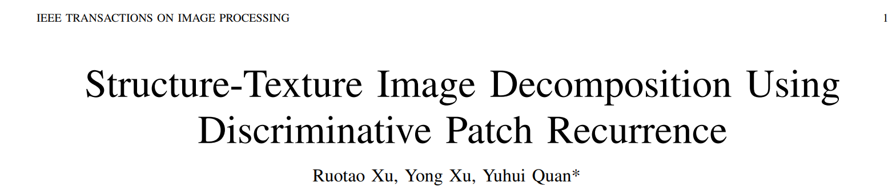

> 作者：许若涛 许勇 全宇晖
>
> 论文链接：https://ieeexplore.ieee.org/document/9295402

本文简要介绍TIP2020 录用论文"Structure-Texture Image Decomposition Using Discriminative Patch Recurrence"的主要工作。该论文主要针对非局部自相似（Non-local self similarity）特性，在结构-纹理图像分解问题上的歧义性，提出了区分性的非局部自相似特性，即纹理的各向同性非局部自相似特性和结构的各向异性非局部自相似特性。在该特性的基础上，本工作建立了一个各向同性稀疏化系统，以精准区分图像中纹理和结构。

## 什么是结构-纹理图像分解？

结构-纹理图像分解是一个经典的图像处理问题。这种分解旨在把图像分成两个部分：结构部分和纹理部分。其中，结构部分指的是图像分段平滑的部分，一般包括图像同构的区域、物体的轮廓和显著边缘；纹理部分则是指图像中具有重复性和振荡性的部分，如草地、织物、树皮等。如下图所示。

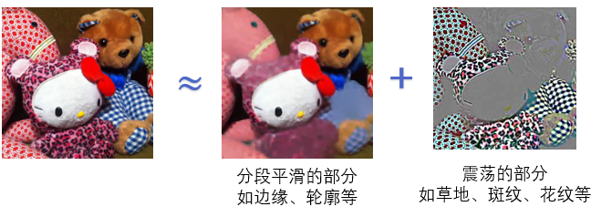

一方面，由于纹理和卡通本身是图像的重要组成部分，图像分解对图像的理解及理论分析有着至关重要的作用；另一方面，纹理和结构往往需要在实际应用中区分对待，图像分解在图像去噪、图像补全、图像上色、光流估计、深度估计等任务上都有着重要的应用。

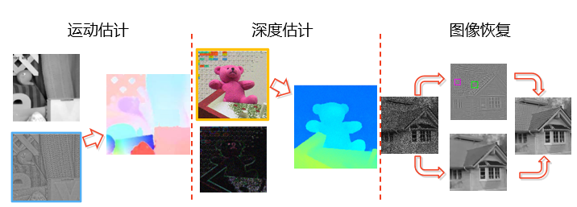

## 研究背景及相关工作

在结构-纹理图像分解中，我们的目标是求得图像的结构部分和纹理部分，而我们的已知条件就只有以下一条等式：
$$
u+v=f
$$
其中，$u\in\mathbb{R}^{N}$ 表示图像的结构部分，$v\in\mathbb{R}^{N}$表示图像的纹理部分，$f\in\mathbb{R}^{N}$则是给定的图像。显然，在该问题中，未知数的数目（$2N$)要远大于等式的个数（$N$)。因此，该问题是一个欠定问题，需要引入额外的先验进行求解。形态成分分析（Morphology component analysis， MCA）给出了一个经典的模型：
$$
\begin{array}{l}
\min _{u, v}  \phi(u)+\psi(v) \\
s . t .    u+v=f
\end{array}
$$
其中，$\phi(\cdot)$和$\psi(\cdot)$是基于结构和纹理部分的先验设计的正则化项。显然，$\phi(\cdot)$和$\psi(\cdot)$的设计是该模型成功的关键。已有的工作针对卡通的正则化做出了不少成功的尝试，如经典的全变分范数、小波/曲波下的稀疏等。对于纹理，由于其本身的复杂性和多样性，其正则化的设计则往往更具挑战性。早期的工作包括G-范数、字典学习、低秩近似等。近年来，受非局部自相似性在图像恢复中取得的优秀性能所启发，不少研究者也尝试利用非局部自相似先验对纹理进行正则化。本文的工作也同样是从非局部自相似性出发进行研究和改进的。这里，我们先对非局部自相似先验进行一个简单的介绍。这样先验认为，图像中的每一个图像块，总是能在图像中的其他位置找到别的相似图像块。下图是经典工作BM3D中给出的一些例子。

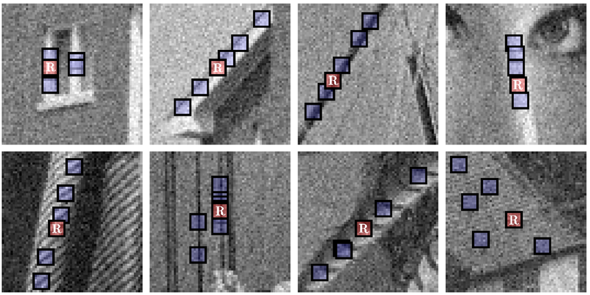

## 区分性的非局部自相似性

然而，直接将非局部自相似先验应用于结构-纹理图像分解往往不能取得令人满意的效果。其中一个重要的原因是非局部自相似先验对于结构-纹理图像分解有一定的歧义性。这里，我们先看一下一些例子。下图给出了一些以**纹理部分为主**的图像块（红色图像块）和在各自图像找到的相似图像块（蓝色图像块）。

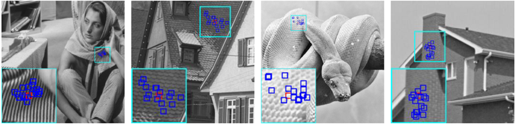

（需要注意，由于纹理和结构部分对于我们来说都是未知的，我们无法直接得到纹理和结构部分的匹配结构。因此，我们只能针对以纹理/结构成分为主的区域进行匹配，以分析纹理/结构的性质）

可以看到，我们总是能在图像块的周围找到不少相似的图像块的。可见，纹理部分是具有非局部自相似性的。接下来，我们再看一下结构部分的情况。下图给出了一些以**结构部分为主**的图像块（红色图像块）和在各自图像找到的相似图像块（蓝色图像块）。

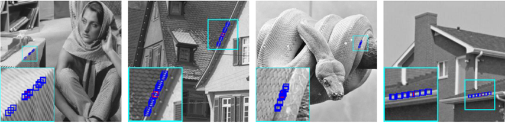

同样可以看到，我们也能在图像块的周围找到相似的图像块。因此，结构部分也具有非局部自相似性。那么，问题就出现了，既然结构和纹理都符合非局部自相似特性，那我们又怎么能通过非局部自相似都结构和纹理进行区分呢？也正是因为这个原因，已有的利用非局部自相似性对纹理进行正则化的方法往往会误将一些边缘结构纳入到纹理当中，并造成结构部分的模糊。

这里，我们再回头看看以上例子。尽管纹理图像块和结构图像块都能找到大量的相似图像块，这些图像块的空间分布是有明显区别的。具体来说，我们可以看到，对纹理来说，相似的图像块一般分布在参考图像块的周围各个方向的；而对结构来说，相似的图像块只沿着一个单一的方向分布。这正是非局部自相似现象在纹理和结构上的不同之处。这里，我们将前者称为纹理的各向同性非局部自相似特性，后者称为结构的各向异性块非局部自相似特性。

需要注意的是，已有的图像块匹配机制是没办法体现这一区别。出于效率的考虑，已有的方法一般只在参考图像块的邻域中进行前$k$近邻搜索。但是，由于搜索过程中并未考虑到图像块的空间分布，这些方法在纹理部分和结构部分找到的都是高度相似的图像块。尽管它们的分布有着明显区别，如下图（左）所示。针对这一问题，我们提出了带方向地图像块匹配方法，以体现相似图像块在空间分布上的不同。如下图（右）所示，我们在每个参考图像的邻域划分出不同方向的若干个带状区域（图像中以不同颜色显示），并在各个方向中分别进行前$k$近邻搜索。如此一来，对于纹理而言，由于其各向同性非局部自相似特性，我们在每个区域中找到的图像块都是高度相似的。但是，对于结构而言，由于其各向同性非局部自相似特性，往往只有在其边缘方向找到的图像块是相似的，其他方向则不然。下图给出给出了两个方法的对比。

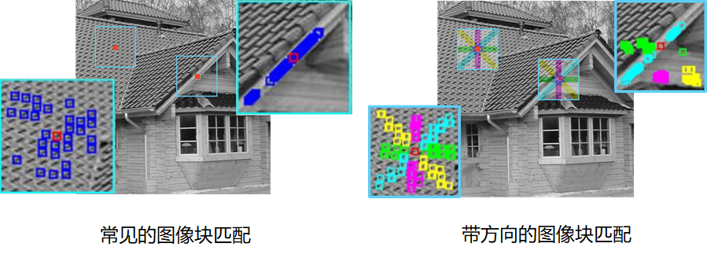

## 各向同性非局部稀疏化变换

有了上述的带方向的图像块匹配，我们就可以针对图像块匹配的结果，构造各向同性的非局部稀疏化变换，以对纹理部分进行正则化。首先，我们定义第$i$方向的拉普拉斯矩阵：
$$
\tilde{{L}}^{(d)}(i,j)=
	\left\{
	\begin{array}{ll}
	1, & {i=j;} \\
	{-\frac{\omega ({p}_i,{p}_j)}{\sum_{k\in {\mathbb{S}^{(d)}_i}} \omega ({p}_i,{p}_k)}, }
	&   {j \in\mathbb{S}^{(d)}_i;}  \\
	0, & \textrm{otherwise},
	\end{array} \right.
$$
该拉普拉斯矩阵能稀疏化纹理部分和沿第$i$个方向分布的边缘结构。随后，我们将所以$\tilde{L}^{(i)}$堆叠并得到$L$:
$$
L = [\tilde{L}^{(1)}; \cdots;  \tilde{L}^{(D)}]\in\mathbb{R}^{{ND\times N}}.
$$
这样得到$L$仅能稀疏化纹理部分，能有效地区分纹理和结构。下图给出了一个简单的例子。

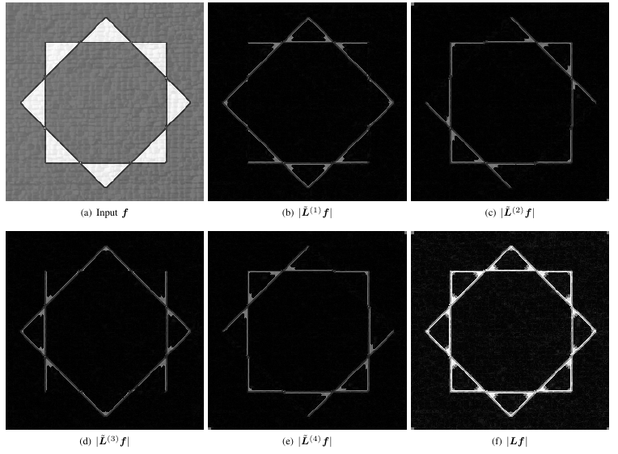

## 结构-纹理分解模型

我们利用上述的各向同性非局部稀疏化变换对纹理进行正则化。分解模型如下：
$$
\begin{array}{l}
\min _{\boldsymbol{u}, \boldsymbol{v}}\left\|\operatorname{diag}\left(\boldsymbol{\lambda}_{1}\right) \boldsymbol{W} \boldsymbol{u}\right\|_{1}+\left\|\operatorname{diag}\left(\boldsymbol{\lambda}_{2}\right) \boldsymbol{J} \boldsymbol{v}\right\|_{1}, \\
\text { s.t. } \boldsymbol{u}+\boldsymbol{v}=\boldsymbol{f}
\end{array}
$$
其中，${W}=[\mathcal{S}_{{G}_1};\cdots;\mathcal{S}_{{G}_M}]\in\mathbb{R}^{{MN}\times N}$表示二维小波变换，${J}=[{L}\mathcal{S}_{{H}_1};\cdots;{L}\mathcal{S}_{{H}_Q}]\in\mathbb{R}^{DQN\times N}$表示离散余弦系数上 非局部稀疏化变换。我们在离散余弦系数上进行非局部稀疏化变换，以对纹理部分进行更好的稀疏化。该模型可以转换为以下模型，并通过ADMM求解：
$$
\min _{\boldsymbol{x}}\|\operatorname{diag}(\boldsymbol{\lambda}) \boldsymbol{D} \boldsymbol{x}\|_{1}, \quad \text { s.t. } \boldsymbol{A} \boldsymbol{x}=\boldsymbol{f}
$$
其中，$\boldsymbol{x}=\left[\boldsymbol{u}^{\top}, \boldsymbol{v}^{\top}\right]^{\top}$, $\boldsymbol{A}=[\boldsymbol{I}, \boldsymbol{I}]$, $\boldsymbol{\lambda}=\left[\boldsymbol{\lambda}_{1}^{\top}, \boldsymbol{\lambda}_{2}^{\top}\right]^{\top}$。

## 实验结果

**在合成图像上的实验结果及对比**：

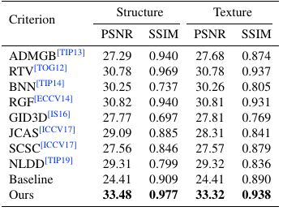

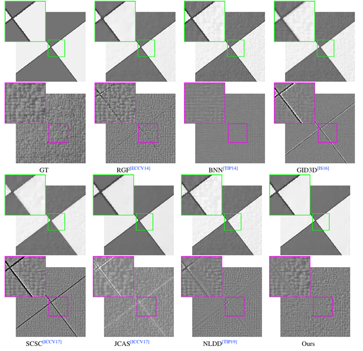

**在真实图像上的实验结果及对比**：

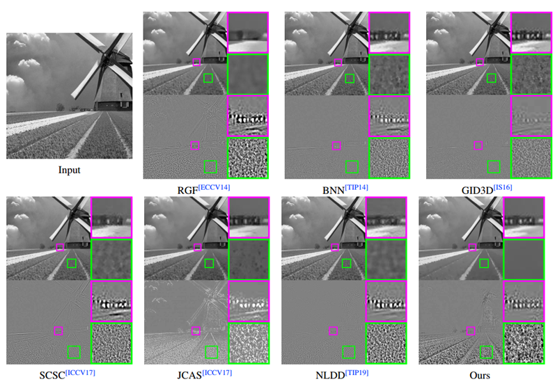

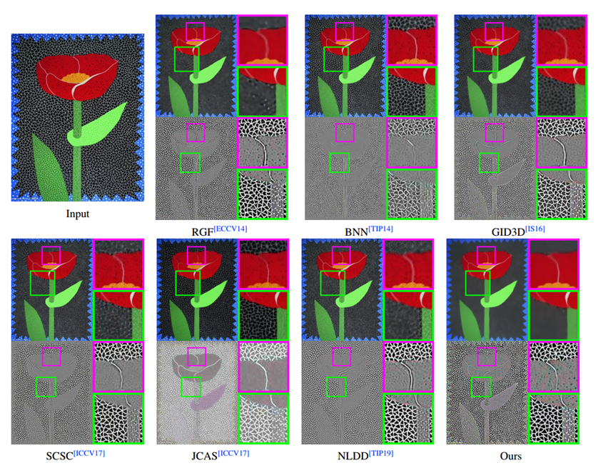